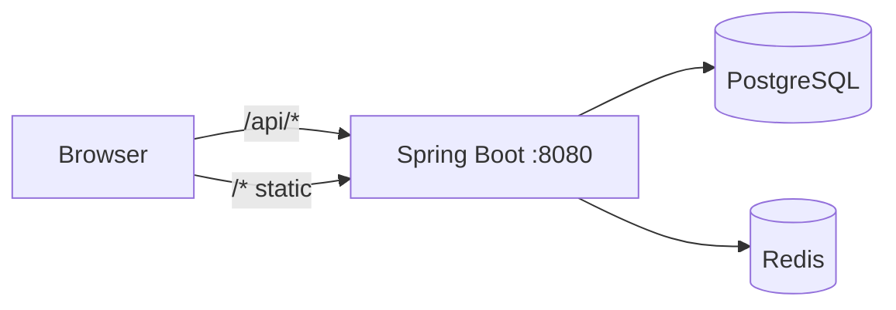
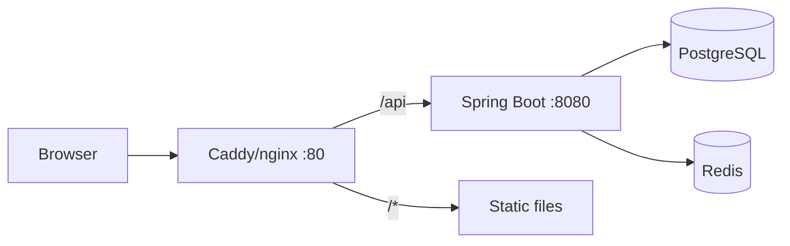
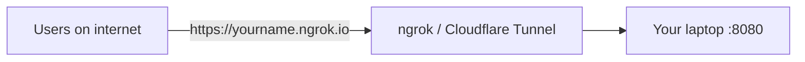

# Deploy BulkBy on Your Laptop as a Server

## Current stack (from codebase)

- **Backend**: Spring Boot 3.2 (Java 17), multi-module Maven. Main runnable: [bulkby-app](bulkby-app). Listens on port **8080**, context path **/api**. Depends on **PostgreSQL** and **Redis** ([application.yml](bulkby-app/src/main/resources/application.yml)).
- **Frontend**: Vite + React monorepo with three apps: **user-app** (3000), **admin-app** (3001), **seller-app** (3002). API calls use relative `/api`; in dev, Vite proxies `/api` to `http://localhost:8080` ([api.js](frontend/packages/shared/services/api.js), [vite.config.js](frontend/packages/user-app/vite.config.js)).

There is no existing Docker or deployment setup in the repo.

---

## Prerequisites on the laptop

1. **PostgreSQL** – install and create database `bulkby` (or use defaults: user `postgres`, password `12345678` per [application.yml](bulkby-app/src/main/resources/application.yml)).
2. **Redis** – install and run on port 6379 (no password by default).
3. **Java 17** and **Maven** – to build/run the backend.
4. **Node.js** (LTS) – to build the frontend.

Optional: run only PostgreSQL and Redis via Docker if you prefer not to install them natively on Windows.

---

## Two deployment approaches

### Option A: Single process – Spring Boot serves API + frontend (recommended)

One JAR serves both the API and the three frontend apps. One port (e.g. 8080), same origin, no CORS issues.

**Steps:**

1. **Build frontend** (production):
  - In `frontend/`: `npm run build` (builds user, admin, seller to `packages/*/dist`).
  - Keep API as relative: `baseURL: '/api'` in [api.js](frontend/packages/shared/services/api.js) so it works when served from the same host/port.
2. **Wire frontend into Spring Boot**:
  - Copy the three `dist` outputs into a single static structure under `bulkby-app/src/main/resources/static/` (e.g. `static/` for user app, `static/admin/` for admin, `static/seller/` for seller), or use the Maven build to copy from `frontend/packages/*/dist` into `target/classes/static/` before packaging.
  - Configure Spring Boot to serve static files from that directory and use an SPA fallback (e.g. `ResourceHandler` + `ViewController` or a simple custom `WebMvcConfigurer`) so routes like `/admin`, `/seller` serve the corresponding `index.html`.
3. **API routing**:
  - Keep context path `/api`. Ensure static mapping does not override `/api/**`; Spring MVC will continue to serve API under `/api`.
4. **Run**:
  - Ensure PostgreSQL and Redis are running.
  - From repo root: `mvn -pl bulkby-app package -DskipTests` then `java -jar bulkby-app/target/bulkby-app-1.0-SNAPSHOT.jar`, or use `mvn -pl bulkby-app spring-boot:run`.
  - Open `http://localhost:8080/` (user), `http://localhost:8080/admin`, `http://localhost:8080/seller`.
5. **Allow access from other devices** (e.g. same Wi‑Fi):
  - Start the JAR with `server.address=0.0.0.0` (or set in `application.yml` / profile) so it listens on all interfaces.
  - Use the laptop's LAN IP (e.g. `http://192.168.x.x:8080`) from other devices. No CORS change needed if they use the same origin (same IP:port).

**Config to add/change:**

- [application.yml](bulkby-app/src/main/resources/application.yml): set `server.address: 0.0.0.0` for network access (or via env/profile).
- Optional profile (e.g. `application-production.yml`) for production JWT secret and DB credentials.

---

### Option B: Reverse proxy – separate backend and frontend

Backend and frontend run as separate processes; a reverse proxy (e.g. Caddy or nginx) on port 80 (or 8080) serves the frontend and proxies `/api` to the backend.

**Steps:**

1. **Build backend**: `mvn -pl bulkby-app package -DskipTests`; run the JAR with PostgreSQL and Redis available.
2. **Build frontend**: `npm run build`. Serve the three apps with a static server (e.g. copy dists into one tree: `/`, `/admin`, `/seller`) or run three separate static servers on different ports and proxy by path in Caddy/nginx.
3. **Install and configure Caddy (or nginx)** on the laptop:
  - Route  `/api/*` → `http://127.0.0.1:8080` (backend).
  - Route `/*` → frontend static files (or to a local static server).
  - Bind to `0.0.0.0` if you want access from other devices.
4. **CORS**: If the browser talks to the proxy (same origin as the frontend), no CORS change is needed. If you ever expose the backend on a different host/port, add that origin to [app.cors.allowed-origins](bulkby-app/src/main/resources/application.yml).
5. **Frontend API base URL**: With the proxy, frontend can keep `baseURL: '/api'` so all requests go to the same host and the proxy forwards to the backend.

---

## Summary comparison

| Aspect               | Option A (Spring Boot serves all)                    | Option B (Reverse proxy)                     |
| -------------------- | ---------------------------------------------------- | -------------------------------------------- |
| Processes            | One JAR                                              | JAR + proxy (+ optional static server)       |
| Ports                | One (8080)                                           | One for proxy (e.g. 80), backend 8080        |
| Frontend integration | Copy dist into JAR / static resources + SPA fallback | Proxy serves static files or separate server |
| Best for             | Simple "one command" laptop server                   | More flexibility, TLS/load balancing later   |

---

## Making it accessible on the internet

To reach the app from the internet (not just LAN), you need a public URL and HTTPS is strongly recommended. Two approaches:

### Option 1: Tunnel (easiest – no router or firewall changes)

A tunnel service exposes your local server through their domain and provides HTTPS. Your laptop can stay behind NAT; no port forwarding.

**Steps:**

1. **Choose a tunnel**:
  - **ngrok**: Sign up at ngrok.com, install CLI, run `ngrok http 8080`. You get a URL like `https://abc123.ngrok-free.app`. Free tier may show a warning page or rotate the URL.
  - **Cloudflare Tunnel (cloudflared)**: Install cloudflared, authenticate, create a tunnel that forwards to `http://localhost:8080`. You get a URL like `https://yourname.your-domain.com` or a free `*.trycloudflare.com` URL.
2. **Backend CORS**: Add the public URL to allowed origins so the browser can call the API from that origin. In [application.yml](bulkby-app/src/main/resources/application.yml) set `app.cors.allowed-origins` to include your tunnel URL (e.g. `https://abc123.ngrok-free.app`). For multiple origins use a comma-separated list or YAML list. Restart the backend after changing.
3. **Frontend API URL**: If the frontend is served from the same tunnel URL (e.g. you open `https://abc123.ngrok-free.app` and the app loads there), keep `baseURL: '/api'` – same origin. If you ever serve the frontend from a different domain, set the API base URL to the tunnel URL (e.g. via env like `VITE_API_URL` and build-time replacement) and keep CORS in sync.
4. **Security**: Use a strong `JWT_SECRET` and DB password; the app is reachable from the internet. Your existing Redis rate limiting ([RedisRateLimiter](bulkby-auth/src/main/java/org/bulkby/auth/util/RedisRateLimiter.java)) helps against abuse.

**Pros**: No router config, automatic HTTPS, works from any network. **Cons**: Free tunnel URLs can change (ngrok); traffic goes through the provider; not ideal for long-term production.

---

### Option 2: Direct exposure (port forwarding + your own URL)

Your laptop gets a stable public URL; traffic goes directly to your home connection.

**Steps:**

1. **Dynamic DNS (DDNS)**: Home IPs usually change. Use a DDNS provider (e.g. No-IP, DuckDNS, or your router's built-in DDNS) to get a hostname (e.g. `bulkby.ddns.net`) that always points to your current public IP.
2. **Port forwarding**: On your router, forward external port 443 (HTTPS) or 80 (HTTP) to your laptop's LAN IP and the port where the app (or reverse proxy) listens. If you use Option A (Spring Boot serves all), forward to 8080; if you use Option B, run Caddy/nginx on 443 and forward to that.
3. **HTTPS with Caddy**: Run Caddy on the laptop (e.g. port 443). It can obtain and renew Let's Encrypt certificates automatically if port 80 or 443 is reachable from the internet. Caddy config: reverse proxy to `http://127.0.0.1:8080` (or serve static + proxy `/api` as in Option B). Use your DDNS hostname in the Caddy config so the certificate is issued for it.
4. **CORS**: Set `app.cors.allowed-origins` in [application.yml](bulkby-app/src/main/resources/application.yml) to your public URL(s), e.g. `https://bulkby.ddns.net`.
5. **Firewall**: Allow inbound 443 (and 80 if used for ACME) on the laptop's firewall. Restrict other ports.
6. **Security**: Strong `JWT_SECRET`, DB password, and Redis password if exposed. Consider rate limiting and monitoring.

**Pros**: Full control, stable URL, no third-party tunnel. **Cons**: Requires router access and a DDNS hostname; your home IP is exposed; ISP may restrict hosting.

---

## Cost factors

- **Tunnels**: **ngrok** free tier has rotating URLs, bandwidth limits, and may show an interstitial; paid plans add custom domains and higher limits. **Cloudflare Tunnel** is free (including free `*.trycloudflare.com` or your own domain via Cloudflare); you only pay if you buy a domain elsewhere.
- **DDNS**: **DuckDNS**, **No-IP** free tier, and many router-built-in DDNS are free. Some providers charge for custom domains or premium features.
- **Domain**: A custom domain (e.g. bulkby.com) typically costs about $10–15/year from a registrar; optional if you use free tunnel or DDNS subdomains.
- **TLS**: **Let's Encrypt** is free. Caddy/nginx are free and open source.
- **Infrastructure on your laptop**: PostgreSQL, Redis, Java, Node, Caddy/nginx – no licence cost. Electricity and wear on the laptop are marginal if it is already on.
- **Internet**: Usually no extra fee for hosting from home; check your ISP’s terms (some restrict or prohibit running servers). Data usage counts against your cap if you have one.
- **BulkBy app**: [application.yml](bulkby-app/src/main/resources/application.yml) uses `file.storage-type: local` and `payment.gateway.enabled: false`. If you later enable **S3** (or another cloud store), you pay for storage and egress. If you enable **Stripe/PayPal** (`payment.gateway.enabled: true`), payment providers charge per transaction (e.g. ~2.9% + fixed fee).

**Summary**: You can run and expose the app at **zero direct cost** using Cloudflare Tunnel (or ngrok free tier) and free DDNS; optional costs are a custom domain, ngrok paid plan, and any payment/file-storage services you enable.

---

## Checklist for "laptop as server"

- Install and run **PostgreSQL** (create DB `bulkby`) and **Redis**.
- Backend: build and run with DB/Redis reachable; set `server.address=0.0.0.0` if other devices should access it.
- Frontend: production build; either embed in Spring Boot (Option A) or serve via reverse proxy (Option B).
- Use a strong **JWT_SECRET** and DB password when not on a dev-only setup ([CONFIG.md](CONFIG.md)).
- Optional: run backend (and proxy if used) as a Windows service or via a startup script so the "server" starts after reboot.
- **Internet access**: Use a tunnel (ngrok / Cloudflare Tunnel) for quick HTTPS with no router config; or use DDNS + port forward + Caddy/Let's Encrypt for a stable public URL. Add the public URL to `app.cors.allowed-origins` in [application.yml](bulkby-app/src/main/resources/application.yml).

If you tell me whether you prefer Option A (single JAR) or Option B (reverse proxy), I can outline the exact file changes and commands (e.g. Maven resource copy, static layout, and SPA fallback for Option A, or a minimal Caddyfile for Option B).